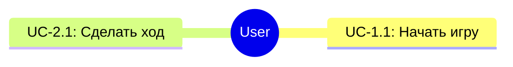

tbd:
- Как описывать экраны?
- Добавить описание требования
- Где показывать общую схему взаимодействия с серверами?

# Описание
Функциональность стандартной игры на одном устройстве с передачей хода от крестиков к ноликам

# Глоссарий
- Игрок 1 - игрок, начинающий игру первым. Играет за крестики.
- Игрок 2 - игрок, вступающий в игру вторым. Играет за нолики.

# Бизнес-процессы
## BP-1: Обновление запаса крестиков и ноликов на складе

# Пользовательские истории
- US-1: Я, как пользователь, хочу сразу начинать играть после входа в приложение, чтобы не терять время

# Пользовательские сценарии

  
UC-1.1: Начать игру

    <table>
       <thead>
          <tr>
             <th>Header1</th>
             <th>Header2</th>
          </tr>
       </thead>
       <tbody>
          <tr>
             <td>Основной актор</td>
             <td>Пользователь</td>
          </tr>
          <tr>
             <td>Предусловия</td>
             <td>Приложение запущено, нет ни одной активной игры</td>
          </tr>
          <tr>
             <td>Постусловия</td>
             <td>Игра начата</td>
          </tr>
          <tr>
             <td>Триггер</td>
             <td>Пользователь начинает игру</td>
          </tr>
          <tr>
             <td>Примечание</td>
             <td>На дизайне решить, как именно начинать игру</td>
          </tr>
          <tr>
             <td>Основной сценарий</td>
             <td>1. Пользователь начинает игру 
             2. Система выводит окно с согласием на сбор статистических данных (Текст согласия - tbd) 
             3. Пользователь соглашается 
             4. Система создает новую игру с пустым полем </td>
          </tr>
          <tr>
             <td>Альтернативные сценарии</td>
             <td>A-3.1 Пользователь не соглашается 
                Система закрывает окно. Игра не начинается. Пользователь возвращается на стартовый экран.
             </td>
          </tr>
       </tbody>
    </table>

  
UC-2.1: Сделать ход

    <table>
       <thead>
          <tr>
             <th>Header1</th>
             <th>Header2</th>
             <th>Header3</th>
          </tr>
       </thead>
       <tbody>
          <tr>
             <td>data1</td>
             <td>data2</td>
             <td>data3</td>
          </tr>
          <tr>
             <td>data11</td>
             <td>data12</td>
             <td>data13</td>
          </tr>
       </tbody>
    </table>

# Используемые справочники
- Справочник локализации текстов

# Макеты дизайна

# Функциональные требования

# Нефункциональные требования

# Продуктовые метрики и события
## Метрики
|№ |Название |Триггер|
|----|----|----|

## События
|№ |Название |Алгоритм рассчета|
|----|----|----|

# История изменений
|Дата | Автор   |Причина    |
|----|----|----|
|25.06.2024    |Марк Аврелий    |Описание создано после защиты системного анализа по ссылке (tbd)    |
