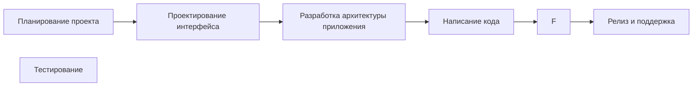

Процесс разработки в команде мобильных разработчиков может выглядеть следующим образом:

1.  *  * Планирование проекта *  * : На этом этапе команда обсуждает требования к проекту, определяет цели и задачи, а также планирует сроки выполнения работ.

2.  *  * Проектирование интерфейса *  * : Дизайнеры создают макеты интерфейса приложения, учитывая потребности пользователей и технические возможности платформы.

3.  *  * Разработка архитектуры приложения *  * : Команда разработчиков определяет структуру приложения, выбирает необходимые технологии и инструменты, а также разрабатывает архитектуру базы данных.

4.  *  * Написание кода *  * : Разработчики пишут код для создания функциональности приложения, используя выбранные языки программирования и фреймворки.

5.  *  * Тестирование *  * : После написания кода проводится тестирование приложения на различных устройствах и операционных системах для выявления ошибок и недочетов.

7.  *  * Релиз и поддержка *  * : Готовое приложение публикуется в соответствующих магазинах приложений, а команда продолжает поддерживать его работу, исправляя ошибки и добавляя новый функционал при необходимости.

