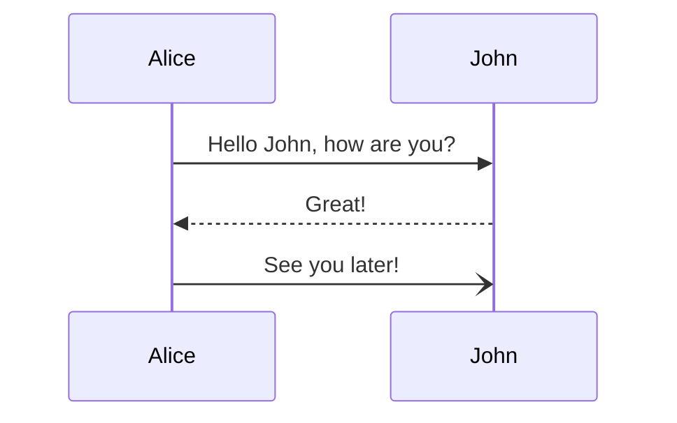

# Штамп задачи
| | |
| ---| ---|
| **Аналитик команды**| ФИО|
| **Бизнес-заказчик**| ФИО|

# 1 Основная информация
| | |
| ---| ---|
| Проблема| У нас есть проблема|
| Цель| Хотим повысить конверсию|
| User Story| Как Пользователь, я хочу видеть на карте точку назначения, чтобы знать куда ехать|
| Критерии приемки|  |
| Бизнес-постановка| -ссылка-|
| Задача| -ссылка-|
| Макеты| -ссылка-|

# 2 Глоссарий
| Термин| Описание|
| ---| ---|
| | |

# 3 Бизнес требования
Основные БТ:
1.  Бизнес требование 1
2.  Бизнес требование 2

## Бизнес процессы
* AS IS (картинка + ссылка)
* TO BE (картинка + ссылка)

# 4 Нефункциональные требования
## Требования КБ

1. Нужно, чтобы было безопасно.

## Другие требования
* Сделать красиво
* Производительность
* Масштабируемость
* Устойчивость
* Локализация
* И т.д.

# 5 Архитектура
Верхнеуровневая схема c1

# 6 Функциональные требования
## Диаграмма Use Cases

## Описание сценариев
### UC-1:
См. Шаблон описания юзкейса

## Sequence diagrams

## Требования Backend
* Описание данных
* Справочники
* Описание интеграций
* Требования к доработке (поведение системы, логика обработки данных, логика расчетов и т.д.) 

Если доработка планируется в нескольких сервисах, выделить подразделы для описания доработок каждого сервиса.

## Требования Web

Описать:
* Как пользователь попадет на новые экраны
* Как изменятся существующие экраны
* Особенности новых и изменяемых элементов экрана (особенности поведения, маски, валидацию и т.д.)
* Как и какие запросы выполнять:
   * Для получения данных
   * При совершении пользователем определенных действий
* Какие ошибки могут возникнуть, и какое отображение для них предусмотреть
* Какие заглушки, скелетоны, лоадеры и прочее использовать, если не указано в дизайне.

## Требования Mobile

Описать:
* Как пользователь попадет на новые экраны, какие экраны открываются по умолчанию
* Как изменятся существующие экраны
* Особенности новых и изменяемых элементов экрана (особенности поведения, маски, валидацию и т.д.)
* Как и какие запросы выполнять:
   * Для получения данных
   * При совершении пользователем определенных действий
* Какие ошибки могут возникнуть, и какое отображение для них предусмотреть
* Какие заглушки, скелетоны, лоадеры и прочее использовать, если не указано в дизайне.

# 6 Риски и ограничения
Перечислить в разделе то, что может повлиять на сдвиг сроков по задаче:
* Зависимости от других команд/задач
* Зависимости от других функций (архитекторы, devops и т.д.)
* Нехватка ресурсов в команде (qa, sa, и т.д.)
* Необходимость составления плана релизов по сложной крупной задаче
* И т.д.

Необязателен к заполнению.

1. Доступы и настройка стендов для разработки в соседнем сервисе.
2. Потребуется ревью от разработчиков соседней команды.
3. Зависит от релиза задачи Х (нужно выкатывать до/одновременно/после).

# 7 Разметка

# 8 Декомпозиция
Без оценок:

|**№**| **Задача**| **Компонент**| **Оценка на теханализ**| **Предварительная оценка на разработку**|
| ---| ---| ---| ---| ---|
| 1.| Название задачи 1| Backend| 2 дня| 5 дней|
| 2.| Название задачи 2| Backend| 1 день| 3 дня|
| 3.| Название задачи 3| Frontend| 2 sp| 5 sp|
| 4.| Название задачи 4| iOS| 2 часа | 5 часов|

# 9 Вопросы

| **№**| **Вопрос**| **Ответ**| **Открыт/Решен**|
| ---| ---| ---|  ---|
| 1. | | |  |

